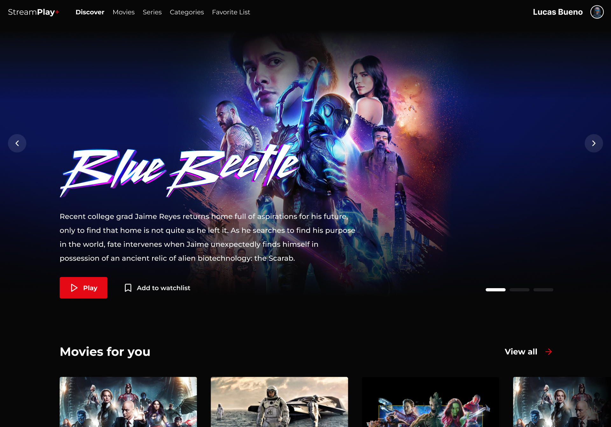

# StreamPlay+

 

<p align="center">  

### Visão Geral

Este projeto é uma plataforma de streaming desenvolvida com o objetivo de aprimorar minhas habilidades em desenvolvimento web, especificamente usando a biblioteca React. O projeto é parte do meu portfólio de estudos e demonstra minhas habilidades em construir aplicativos web interativos e responsivos.

### Tecnologias Principais

- **React**: Utilizamos o React para criar uma interface de usuário dinâmica e responsiva.
- - **Node.js**: A plataforma backend é construída usando Node.js, que fornece uma API para alimentar a plataforma.
- - **Express**: Usamos o Express.js para criar rotas da API e gerenciar solicitações HTTP.

### Principais Funcionalidades

- **Streaming de Vídeo**: Os usuários podem transmitir e assistir a vídeos em tempo real.
- **Biblioteca de Conteúdo**: Oferecemos uma ampla variedade de conteúdo para os usuários explorarem.
- **Recomendações Personalizadas**: Implementamos algoritmos de recomendação para sugerir conteúdo relevante aos usuários.
- **Contas de Usuário**: Os usuários podem criar contas com perfis múltiplos e personalizar suas experiências.
- **Responsividade**: A plataforma é totalmente responsiva, funcionando em dispositivos móveis e desktop.

### Pré-requisitos Certifique-se de que você tenha o seguinte instalado em sua máquina:

- [Node.js](https://nodejs.org/)
- [Npm](https://www.npmjs.com/) ou [Yarn](https://yarnpkg.com/) (recomendado)

### Instalação e Execução

1. Clone o repositório:

```bash
git clone https://github.com/seu-usuario/seu-projeto.git
cd seu-projeto
```

2. Instale as dependências:

```bash
npm install
# ou
yarn
```

3. Configure as variáveis de ambiente se necessário.
4. Inicie o servidor de desenvolvimento:

```bash
npm start
# ou
yarn start
```

5. Abra o navegador e acesse `http://localhost:3000` para ver a plataforma em ação.

### Aprendizado e Contribuição

Este projeto é uma demonstração do meu progresso no desenvolvimento web. Contribuições e feedback são bem-vindos. Sinta-se à vontade para clonar e personalizar este projeto para seus próprios estudos ou usá-lo como inspiração para seu portfólio.

### Licença

Este projeto está licenciado sob a Licença MIT - consulte o arquivo [LICENSE](https://chat.openai.com/c/LICENSE) para mais detalhes.

Desenvolvido com ❤️ por [Lucas Bueno](https://github.com/lucxsbueno)
